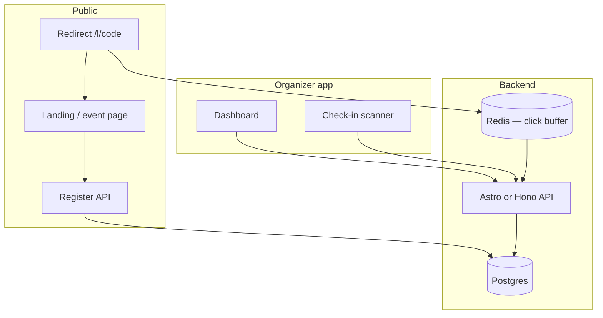

# Implementation plan (tentative)

**Last updated:** 2026-07-03  
**Status:** draft — product name, domain, and auth provider open.

**Punta** = org-grade **link shortener + event management + check-in**, with campaign analytics that connect clicks to attendance.

---

## 1. Problem statement

Campus and community orgs repeatedly stitch together:

- a URL shortener for posters,
- a form for registration,
- a spreadsheet for attendance,
- and screenshots for "analytics."

Each piece works in isolation but **nothing connects the poster QR to who showed up**. Punta treats **campaign link → event page → registration → check-in** as one funnel with org branding and exports.

---

## 2. Differentiation (value thesis)

| Capability | Generic link tool | Generic form | Punta |
| ---------- | ----------------- | ------------ | ----- |
| Short URL + QR | ✓ | — | ✓ |
| Custom landing page | — | partial | ✓ event-native |
| Registration | — | ✓ | ✓ tied to event |
| Per-channel attribution | basic clicks | — | clicks → signups → check-ins |
| Door check-in | — | add-on / manual | ✓ built-in QR ticket |
| Org team roles | — | limited | owner / editor / door / analyst |
| Attendance export | — | manual | ✓ CSV with campaign source |
| Campus venue link | — | — | Room TBA deep link |

**Design principle:** optimize for **org volunteers** running 3–10 events per sem, not enterprise marketing suites.

---

## 3. Product goals

### Must have (MVP)

- **Org** with slug, name, logo upload (optional).
- **Event:** title, datetime, timezone `Asia/Manila`, venue text + optional Room TBA URL, capacity, description (markdown).
- **Campaign links:** multiple short links per event (`/l/{code}`) with labels (poster, IG, partner).
- **Public event page** — mobile-first; register button.
- **Registration form:** name, email, optional custom fields (college, year); waitlist when full.
- **Confirmation:** on-screen ticket + QR encoding `registrationId`.
- **Check-in scanner** (volunteer logged in): scan ticket → mark present.
- **Dashboard funnel:** per link — clicks, registrations, check-ins.
- **CSV export** of registrants with source link label.
- **Auth:** email magic link for organizers; attendees register without account.

### Should have (v0.2)

- Email confirmation with ticket QR (Resend/Postmark).
- Event duplicate / template from past event.
- Embed mode: `iframe` registration widget for org website.
- Webhook: `registration.created`, `checkin.completed`.
- Discord notification via uplbtools bot pattern.

### Should have (v0.3)

- Custom domain `links.yourorg.org` (CNAME).
- Recurring events series.
- Walk-in registration at door (staff adds row).
- Basic spam protection (Turnstile/hCaptcha on public register).

### Won't have (yet)

- Payment / ticket sales (GCash integration is a separate epic).
- Full CRM, email campaigns, seating charts.
- Public link directory / SEO browse (orgs are unlisted unless shared).

---

## 4. User journeys

### Journey A — General Assembly

1. ES org creates "GBM March" event, capacity 200, venue "DL Umali Hall" + Room TBA link.
2. Creates links: `gbm-poster`, `gbm-fb`, `gbm-partner-cssc`.
3. Poster QR → `gbm-poster` → landing → 180 register, 20 waitlisted.
4. Door volunteer opens Scanner → 142 check-ins.
5. Secretary exports CSV; funnel shows FB link drove most clicks but poster drove most check-ins.

### Journey B — Link-only (no event)

MVP supports **redirect links** under org namespace for non-event use (announcements, docs). Same analytics shell; registration disabled. Keeps orgs from needing a second tool for pure short links.

---

## 5. Architecture



| Choice | Recommendation | Rationale |
| ------ | -------------- | --------- |
| App framework | Astro 7 + Svelte islands | Matches Room TBA; SSR for public pages |
| DB | Supabase Postgres + Drizzle | Same ops story as sibling repos |
| Redirect edge | Cloudflare Worker or Vercel edge | Low-latency `302` + click log |
| Auth (org) | Supabase Auth magic link | Avoid password support burden |
| File storage | R2 / Supabase storage | Org logos |
| Email | Resend | Transactional tickets |

**Click analytics:** edge logs `(linkId, ts, ua hash)` to Redis stream; worker aggregates hourly into Postgres to avoid write amplification on redirect.

---

## 6. Data model (sketch)

```ts
type Event = {
  id: string;
  orgId: string;
  slug: string;
  title: string;
  startsAt: string;
  endsAt: string | null;
  timezone: "Asia/Manila";
  venueName: string | null;
  venueUrl: string | null; // Room TBA, Google Maps, etc.
  capacity: number | null;
  waitlistEnabled: boolean;
  descriptionMd: string;
  status: "draft" | "published" | "archived";
};

type CampaignLink = {
  id: string;
  eventId: string | null; // null = pure redirect
  code: string; // short code globally unique
  label: string; // "poster", "instagram"
  destinationUrl: string; // redirect target OR event page if eventId set
  clickCount: number;
};

type Registration = {
  id: string;
  eventId: string;
  campaignLinkId: string | null;
  email: string;
  name: string;
  fields: Record<string, string>;
  status: "confirmed" | "waitlist" | "cancelled";
  checkInAt: string | null;
  ticketToken: string; // signed, in QR
};

type ClickEvent = {
  linkId: string;
  occurredAt: string;
  referrer: string | null;
};
```

**Ticket QR:** JWT or HMAC `{ registrationId, eventId, exp }` — scanner validates offline-capable with cached event public key (v0.2).

---

## 7. URL design

| URL | Purpose |
| --- | ------- |
| `punta.example/l/{code}` | Redirect + click log → event or external URL |
| `punta.example/e/{code}` | Alias to event landing (optional) |
| `punta.example/o/{orgSlug}/{eventSlug}` | Canonical event page |
| `punta.example/o/{orgSlug}` | Org public list (published events) |
| `punta.example/app/*` | Organizer dashboard (auth required) |
| `punta.example/scan/{eventId}` | Check-in mode (door role) |

---

## 8. Custom fields (PH org defaults)

Ship presets orgs can enable:

- College / unit
- Year level
- Org affiliation (member / guest)
- Dietary restrictions
- Accessibility needs

Stored as JSON schema per event; render dynamically on registration form.

---

## 9. Delivery phases

### Phase 0 — Redirect spike (1 session)

- [ ] `link-core`: generate code, store mapping, `302` redirect
- [ ] Click counter (Postgres increment or Redis buffer)
- [ ] Deploy edge redirect on staging subdomain

**Exit:** Create link → 100 redirects → count accurate.

### Phase 1 — Event + registration MVP (3–4 sessions)

- [ ] Org + magic-link auth
- [ ] Event CRUD, publish landing page
- [ ] Campaign links tied to event
- [ ] Registration + waitlist + capacity
- [ ] Ticket QR display
- [ ] Check-in scanner marks `checkInAt`
- [ ] Dashboard funnel + CSV export

**Exit:** End-to-end test event with 2 campaign links and 10 test registrations.

### Phase 2 — Comms & integrations

- [ ] Email ticket
- [ ] Webhooks + Discord notify
- [ ] Room TBA venue picker helper (search room → paste URL)
- [ ] Registration embed widget

### Phase 3 — Scale & monetization hooks

- [ ] Custom domain docs
- [ ] Rate limits + abuse monitoring
- [ ] Pro tier design (only if free tier costs bite)

---

## 10. Testing strategy

| Layer | Focus |
| ----- | ----- |
| `link-core` | Code uniqueness, expired links, circular redirect guard |
| Registration | Capacity race (two last slots), waitlist promotion |
| Check-in | Double scan idempotent, invalid token rejected |
| Integration | Full funnel Playwright: click link → register → scan |
| Security | Ticket forgery, org IDOR, CSV export auth |

---

## 11. Non-functional requirements

| Concern | Target |
| ------- | ------ |
| Redirect p95 | < 50ms at edge |
| Registration POST | < 500ms |
| Uptime | 99.5% (free tier honest SLA) |
| Data | Org can export + delete all registrants for an event |
| PII | Email encrypted at rest optional; never sell data |

---

## 12. Open questions

1. **Domain:** `punta.uplbtools.me` vs standalone brand?
2. **Attendee accounts:** allow "my tickets" login or ticket QR only?
3. **Multi-org users:** one email in many orgs — standard Supabase model.
4. **Moderation:** report abusive public pages — manual queue at launch?
5. **Offline check-in:** queue scans when gym Wi‑Fi dies — v0.2 or v0.3?

---

## 13. Next actions

1. Phase 0 issue in this repo.
2. Validate name **Punta** with org officers (confusing vs "punta sa…"?) — alias repo if renamed.
3. Wireframe: event landing + scanner on 320px.
4. Discord skill doc stub for webhook payload shape.

---

*Goal: orgs stop exporting Forms to Sheets to prove attendance. One funnel, one export.*
